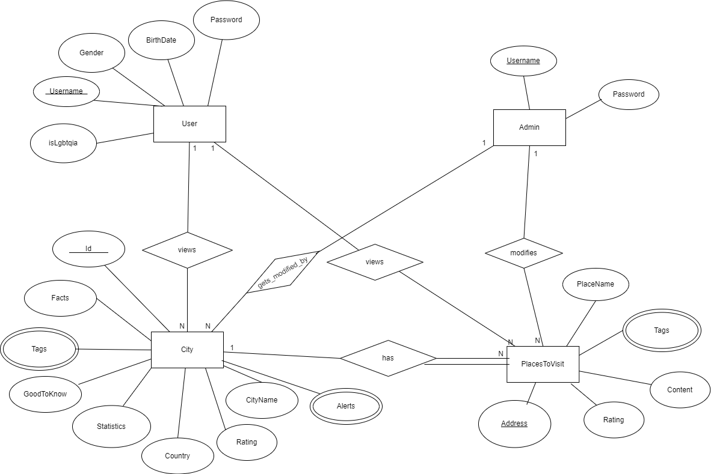

# Backend and Frontend Template

Latest version: https://git.chalmers.se/courses/dit342/group-00-web

This template refers to itself as `group-00-web`. In your project, use your group number in place of `00`.

## Project Structure

| File        | Purpose           | What you do?  |
| ------------- | ------------- | ----- |
| `server/` | Backend server code | All your server code |
| [server/README.md](server/README.md) | Everything about the server | **READ ME** carefully! |
| `client/` | Frontend client code | All your client code |
| [client/README.md](client/README.md) | Everything about the client | **READ ME** carefully! |
| [docs/LOCAL_DEPLOYMENT.md](docs/LOCAL_DEPLOYMENT.md) | Local production deployment | Deploy your app local in production mode |

## Requirements

The version numbers in brackets indicate the tested versions but feel free to use more recent versions.
You can also use alternative tools if you know how to configure them (e.g., Firefox instead of Chrome).

* [Git](https://git-scm.com/) (v2) => [installation instructions](https://www.atlassian.com/git/tutorials/install-git)
  * [Add your Git username and set your email](https://docs.gitlab.com/ce/gitlab-basics/start-using-git.html#add-your-git-username-and-set-your-email)
    * `git config --global user.name "YOUR_USERNAME"` => check `git config --global user.name`
    * `git config --global user.email "email@example.com"` => check `git config --global user.email`
  * > **Windows users**: We recommend to use the [Git Bash](https://www.atlassian.com/git/tutorials/git-bash) shell from your Git installation or the Bash shell from the [Windows Subsystem for Linux](https://docs.microsoft.com/en-us/windows/wsl/install-win10) to run all shell commands for this project.
* [Chalmers GitLab](https://git.chalmers.se/) => Login with your **Chalmers CID** choosing "Sign in with" **Chalmers Login**. (contact [support@chalmers.se](mailto:support@chalmers.se) if you don't have one)
  * DIT342 course group: https://git.chalmers.se/courses/dit342
  * [Setup SSH key with Gitlab](https://docs.gitlab.com/ee/ssh/)
    * Create an SSH key pair `ssh-keygen -t ed25519 -C "email@example.com"` (skip if you already have one)
    * Add your public SSH key to your Gitlab profile under https://git.chalmers.se/profile/keys
    * Make sure the email you use to commit is registered under https://git.chalmers.se/profile/emails
  * Checkout the [Backend-Frontend](https://git.chalmers.se/courses/dit342/group-00-web) template `git clone git@git.chalmers.se:courses/dit342/group-00-web.git`
* [Server Requirements](./server/README.md#Requirements)
* [Client Requirements](./client/README.md#Requirements)

## Getting started

```bash
# Clone repository
git clone git@git.chalmers.se:courses/dit342/group-00-web.git

# Change into the directory
cd group-00-web

# Setup backend
cd server && npm install
npm run dev

# Setup frontend
cd client && npm install
npm run serve
```

> Check out the detailed instructions for [backend](./server/README.md) and [frontend](./client/README.md).

## Visual Studio Code (VSCode)

Open the `server` and `client` in separate VSCode workspaces or open the combined [backend-frontend.code-workspace](./backend-frontend.code-workspace). Otherwise, workspace-specific settings don't work properly.

## System Definition (MS0)

### Purpose

The main purpose of our system is to make it easier for aspiring travelers to find destinations that are best suited for their travel desires and needs. Based on users' selected preferences and personal details, our system aims to find places to visit - attractions, restaurants, historical sites etc. - for the specified city that the user is choosing. Another main feature of our system is that we will provide live weather warnings, giving insight to travelers as to what they can expect in whichever destination they are considering. The system will be maintained by admins to add, update, and delete cities as well as places to visit.  

### Pages

Home: This will be the first page visited by users, it will have a large clickable map where users can see travel destinations which are selectable. This page will feature a navigation bar of sorts to link users to the other pages once they have been successfully logged in. To log in and sign up, that will be available on the navigation bar, prior to being logged in.

Login/Sign Up: This page will allow for users to either login with their username and password, or choose to create an account for the first time. 

Profile: This page is offered once the user has signed in, and here they are able to include additional information about themselves or even update their password. Here is also where the user can delete their account.

City Page: Cities will be displayed in a carousel type fashion, a neatly organized description of said city, including tags about the city will be provided. There will be a list of places to visit the user can preview that if they want to read more about it will be linked. On a side panel, there will be an option to search and filter through the cities.

Places to Visit Page: Once a user has clicked on the place that they would like to visit and know more about, they will be lead to this page which has more informations about each individual place to visit. The information that can be included are opening hours, links, and ratings. It is structured similarly to the cities page, so the filtering options are also present.

Filter and Sort Pages: For both cities and places to visit, there will be pages to either sort and filter by ratings or filter by tags.

### Proposal for a 5

On our main home page, we want to implement a map of Europe that will showcase all potential weather warnings for the coming week. So when a user is navigating through the map they can select a city, a pop up will display entailing a description of what the expected weather will be. The pop up is colour specific, meaning that the degree of weather intensity will be easily visually described. The purpose of this inclusion is to help our users who are planning their trips to have insight into what they could expect. 

We plan on further integrating this into our cities page, where next to the respective city you view there shall be a coloured indicator [matching the map] that illustrates the intensity of the weather situation currently. Furthermore, when the user hovers over this indicator, a message will appear to detail more about the specifics of the weather (for example thunderstorms, flooding, etc.). 

### Entity-Relationship (ER) Diagram



## Teaser (MS3)


